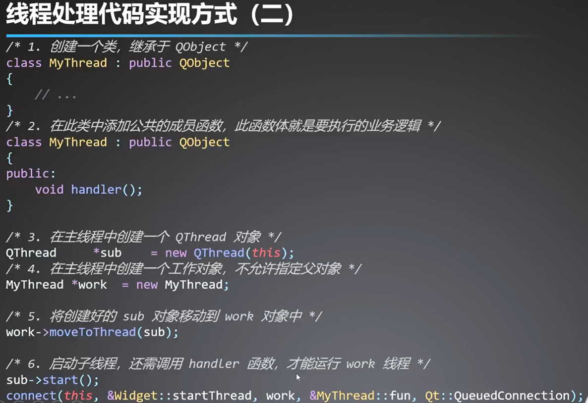
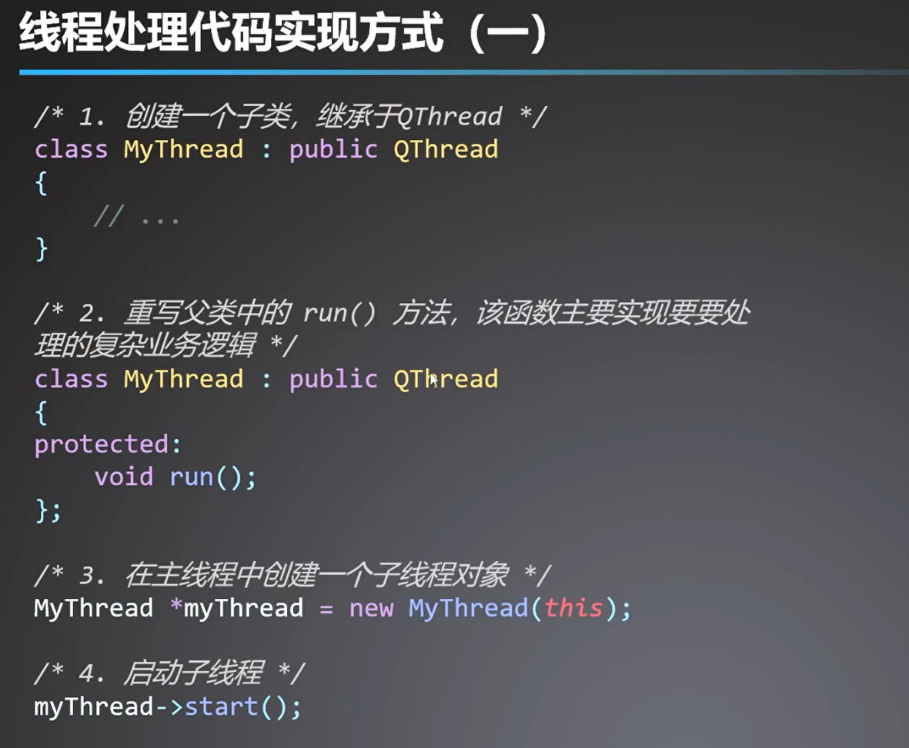

# QT

## 1、原理、历史、产品、区别

原理本质是一个应用框架，在Qt环境下通过调用API来工作。
本身是一个跨平台的c++类库，是标准c++编写的类库；
QT引入了一些新的机制包括：信号[`signals`|`slots`]与槽机制、对象属性机制；

优点是：跨平台，多语言，开源免费。

包含：产品、qtcreator、design 、第三方库；

## 2、控件

设计器，提供一个预览效果，是一个QT工具，是设计和构建图形用户界面。Qt GUI、Qt Designer；

Qt设计器通过表单保存，为xml格式；编译生成c++程序；默认是只读的形式，为了保持和设计器的一致性。

设计界面，搭建框架；现在是能够预览，并不能提供逻辑的编写；

## 3、信号与槽

用来通信的机制，**QT独有**，最后通过Moc重新编译生成C++标准代码；辅助生成C++语法规则的语法。

**属于预编译之前发生的**

实现方式：

1、ui，有两种方式，一种是右击，一种是下方窗口设置；优点是操作便捷，缺点是不利于开发着学习；

2、QT4方式，`connect`使用了宏定义SIGNAL、SLOT，如果有错误在编译阶段不会进行报错，只有运行阶段才会；并且不能传递参数名；普通成员函数不能作为槽函数

3、QT5方式，`connect`传引用，普通成员函数可以作为槽函数，

4、lambda方式，也是在connect函数中使用，优点是代码更简洁；

5、自定义方式，需要自己声明信号函数和槽函数，QT中有`signals:和 slots:`两种关键字；其中signals前面不可加访问权限，slots可以添加；只需要声明不用定义，编译器会自己生成；其中信号需要单独设置触发的connect；

需要包含`Q_OBJECT`宏定义，类是最终继承于QObject，也可以直接包含头文件QObject，前置条件满足才能使用信号与槽机制；

6、函数指针方式：主要目的就是防止编译器产生歧义，告诉编译器使用哪种函数重载的方式；与第四种方式很像，不过是以传递函数指针的方式，**前面需要一个函数指针**；

**推荐使用QT5方式、lambda方式，自定义方式；**

`connect`的函数原型是有许多重载

## 4、列表型控件的创建和介绍

树型、表格、

## 5、展示型控件

label和progress bar作为案例

控件的创建和设计，从帮助文档入手，内容全；

label：纯文本，富文本、图片、数字；

process bar：设置位置、范围、数值、水平|垂直、加载方向，显示字符串；

## 6、输入性控件创建

每一个组件都去自己实现一次；

单行输入lineedit、多行输入textedit、QSpinBox调整框或者叫做旋转框、Qslider进度条、	

限定范围:验证器限定的是一个大范围，正则表达式可以限定具体范围，setmaxlength方法

## 7、动作型控件创建和设置

QPushButton、QToolButton、QCheckBox、QRadioButton与QButtonGroup配合使用、

自动按钮，默认按钮（enter按下）

Qwidget没有自动默认按钮的，QDialog有；

QToolButton可以设置成图标加文字的形式，新建对象之后，需要调用相关方法来设置位置和大小，设置text和icon

QButtonGroup，管理radioButton对象

QCheckBox复选框，有选中何为选中状态，还有部分选中状态；connect中有状态触发和切换触发的信号。

## 8、对象树

什么是对象树？用来组织和管理QObject及其子类创建的对象；

对象树的使用规则：

- 父对象创建在栈区；

- 子类对象创建在堆区；

父对象管理子对象，父对象销毁会自动回收所有管理的子对象；手动删除子对象时，会在父对象中列表的子对象删除；防止被父对象进行重复删除；

---

## 9、项目

需要配置相关的环境；编辑器；

## 10、样式表设置

选择器，属性值；

使用不同部件的`setStyleSheet`方法进行样式设计；

1. background image，一句边框大小设置
2. border image，随着边框拉伸
3. image，当边框大于图片时，图片大小不变，内边距有变化；小于时，大小随着拉伸，内边距等于图；

创建资源包，导入相对的路径；

`Qmovie`，可以实现动图的设置；

`QPlalette`通过画刷的样式设置；

`QWidget`设置背景图片，父部件是不响应的；而对于QDialog父部件和子部件都生效；

把项目跑起来，按照设计文档进行模块化设计就可以；

## 11、窗口布局管理器

设计窗口，先画出来，然后按照拆分每一部分的*控件*

- 水平布局
- 垂直布局
- 分裂布局
- 网格布局
- 弹簧：垂直弹簧、水平弹簧

## 12、部件

Dialog对话框，分为模态对话框、非模态对话框；

exec：没有关闭的情况下，会一直显示；模态；

show：在非模态对话框中使用；

使用在消息、颜色、 字体、文件四种种类型的对话框中；

一定善于查询帮助文档；

## 13、窗口之QMainWindow

窗口编写就是一个个套娃，清楚知道这些函数方法的用法和使用场景就可以使用；

创建菜单栏；

QMenu、QMenuBar、QAction；setShortCut方法；

创建浮动窗口，DockWidget有一个停靠和浮动的效果；

创建中心部件：setCentralWidget

创建状态栏：StatusBar

## 14、QT事件处理事件

事件：内部或者外部产生的事件。

区别信号，信号是一个同步的过程；

比如鼠标相关事件、定时器事件

定时器事件：

**事件**QEvent

鼠标和键盘事件

- 鼠标

  - 继承自QInputEvent
  - QMouseEvent
  - 按键类型：左键、中键、右键、宏定义按键
  - 事件类型鼠标点击、释放等

- 键盘

  - 按键按下、释放事件
  - 单一按键
  - 组合按键

    - 先判断modifiers方法

      - 在进行判断单一按键

- 事件操作都是虚函数，需要在自己窗口中重写

**定时器事件**：定时去做一些事情

- QTimerEvent
- TimerEvent
- QTimer

  - 实现定时器功能
  - 是常用的方式

**绘图事件**

- QPaintEvent

  - 继承自QEvent

- 使用场景：绘制仪表盘等
- 创建画布

  - 创建画笔

    - 设置画笔属性

      - 将画布和画笔关联

- 使用pen.save和pen.restore

  - 之间的设置样式只在其中有效

## 15、事件传递过程

- 事件过滤器

  - QT的处理方式，拦截事件
  - 步骤

    - 1、安装事件过滤器
    - 2、重写eventFilter函数，这是一个虚函数

  - eventFilter

    - 根据evetnType类型来确定是否在一个对象中，不同对象有不同的拦截动作

## 16、动画制作

`QSplashScreen`

- 动画切换效果

**动画设计与特效处理**

- `QPropertyAnimation`
  - 使用状态机来实现组合特效的制作
  - `QStateMachine`

- 以`QGraphicBlurAffect`为代表的：模糊、染色、阴影、透明特效设置；

## QString

### 提供统一的编码格式

- QString头文件
- QObject::tr

  - 可以使用qt工具

### 编辑

- append
- insert
- replace

### 转换

- toInt

  - 子主题 1

- QString::num()

### 查询

- left

  - 左部分

- right

  - 右部分

- at

  - 查询位置

### 参数传递

- QString("%1 %2").arg(num).arg(name)
- str.arg();
- 帮助文档看更多的函数

## 容器类

### 存储数据的数据模板

### 更轻量、更安全、更简单的使用方式

### 顺序容器

- QList
- QLinkedList
- QVector
- QStack
- QQueue

### 关联容器

- QMap
- QMultiMap
- QHash
- QMultiHash
- QSet

1. 使用情况和c++的STL风格类似

- 使用迭代器

  - Qt中的迭代器
  - const_iterator结构体

    - constBegin()
    - constEnd()

2. java风格的迭代器；

## 音视频

### 播放音频

- 创建多媒体类

  - 提供播放功能

- 播放列表

  - 信号与槽

    - 将播放文件通过文件类添加到播放列表
    - 点击播放列表的切换具有效果

  - 播放音频还有一些可以扩充的需求
  - 基本功能：播放、展示、切换

### 播放视频

- QVideoWidget
- QMediaPlayer
  - 1、创建媒体播放器

  - 2、QUrl添加播放文件

  - 3、显示播放窗口

  - 4、媒体播放器进行播放

## 网络通信

### tcp

- 通信流程，老一套

  - 客户端连接服务端

  - 客户端接受数据

  - 显示数据到窗口

- 创建服务端对象

  - 创建客户端对象

  - 监听ip和端口

  - 判断啊是否有连接

  - 发送数据

### udp

- 创建对象

  - 创建套接字对象

  - 绑定端口和ip

  - 接收数据

  - 发送数据

## 多线程处理

### 为什么使用多线程？

提高并发处理效率和提高系统资源使用率；

- 每个QT程序启动后都有一个gui主线程

**子线程没有办法直接使用部件类的，得使用信号与槽机制**

### 子线程退出

- quit
- wait
- 需要等待子线程完成再退出；

### 两种线程处理方式

- 
- 

