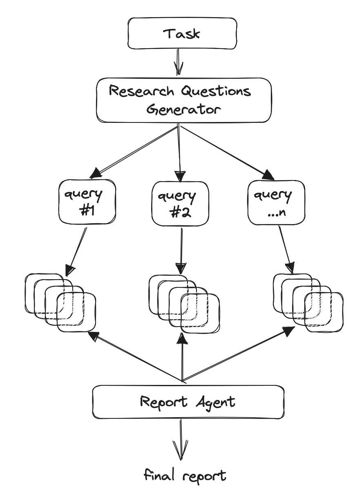

今天学习一篇英文文章：
1. 主题
2. 围绕文章主题，以什么逻辑来表达自己的观点。
3. 该英文文章中的语句结构和单词总结：

文章标题How we built Gpt Researcher

副标题：
1. moving from infinite loops to deterministic results
2. aiming for objective and unbiased results
3. speeding up the research process
4. finalizing the research report
5. the final architecture
6. going forward

提出问题出现的背景，解决方案的来源，接下来大体介绍了解决方案的具体步骤，以及在实现中遇到的挑战，如何进行优化，总结解决方案的具体流程。对未来前景进行展望。通过引导读者理解问题的背景，提出的解决方案、技术实现和优化过程，层次分明，可以在每个章节从问题出发都提出一个解决方案。最终总结成果。

逐步递进，文章从问题出发，到提出解决方案、技术实现和优化过程，让读者紧跟作者思路。

1、将问题分解成单独的的任务，然后把每一个任务都分配智能体来解决，最后汇总成一个解决方案

2、如何提升模型的质量和速度？
基础模型的优势在于总结和重写喂给他的内容；
要利用这个优势，那就考虑需要喂给他正确的、无偏的数据；
假设：
大数据原则：数据量越大，获得有偏数据的概率就越小

3、提升速度的方法就是让这些智能体并行的工作？how？
使用Python提供的并行库来并行的执行任务；

4、接下来的挑战就是整合信息，完成报告。
作者实验了openai的模型和一些开源模型之后，发现gpt-4是最好的，通过提供prompt gpt-4会输出完整的report，并且作者说如果随着gpt的不断迭代，结果会越来越好。

5、最终架构：

1. 生成一个研究问题的大纲，形成对任何给定任务的客观意见。

2. 对于每个研究问题，触发一个爬虫代理，从在线资源中搜索与给定任务相关的信息。

3. 对于每个爬取的资源，只有当它包含相关信息时，才进行跟踪、筛选和汇总。

4. 最后，汇总所有结论的来源，并生成最终的研究报告。

参考文章：

[gpt-researcher
 ](https://docs.gptr.dev/blog/building-gpt-researcher#moving-from-infinite-loops-to-deterministic-results)

more specifically：更具体的说 
aggregating： 合并
infinite:无限的，无穷尽的
manual:手工，人工
seeing how well do_work got me thinking about the greatest potential of xxx and what it meant for xxx.
but the problem was that xxx(it usually ran into never-ending loops)
Nonetheless：尽管如此
hallucinated：使产生幻觉
the first step in solving these issues was to seek more deteministic solutions  
this is when we stumbled upon the recent paper.在这时我们遇到了最近的一篇文章，
the idea is quite simple，相当简单
consist of two components.包含两种组件；
divide xx into 把什么分成
subtasks：子任务
carrying out: 完成
devise a plan: 制定一个计划
eliminate： 消除
finite： 有限的
deterministic：确定的
break the agent steps into： 将agent步骤分解成
as it relates to research，fist create an outline of questions： 
unbiased and objective： 无偏见的，无偏心的
to tackle this challenges： 来解决这个挑战
scrape ： 削除
the idea would be to: 想法是