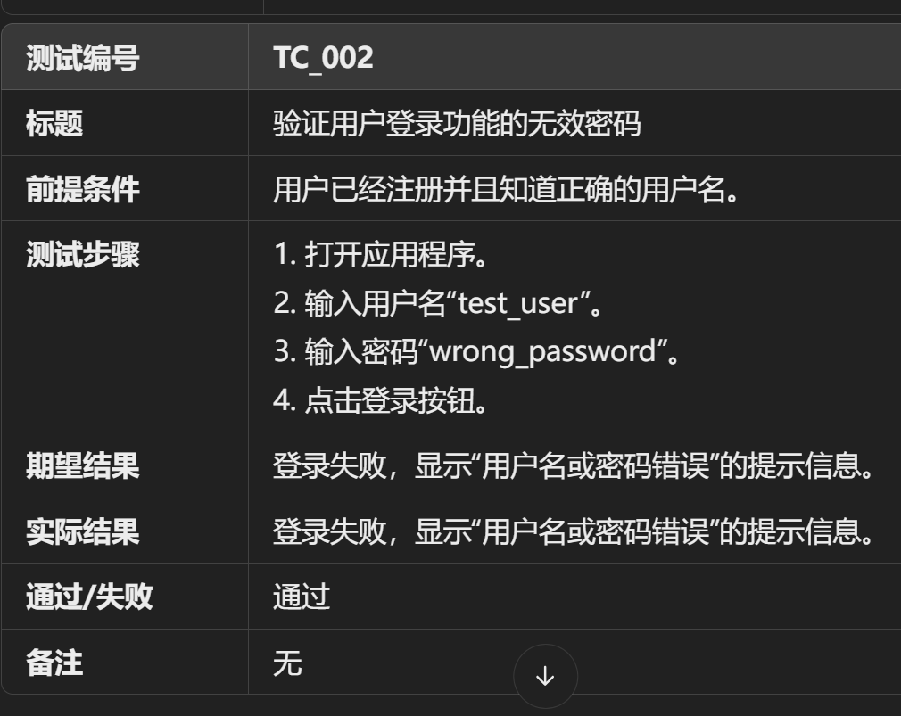

开发人员自己写的自测用例：
1. 应该满足功能需求；
2. 明确输入、输出，还有边界条件；
3. 满足性能要求；
4. 错误处理机制；

一个完整的测试用例应该包含：
1. 测试标题
2. 测试编号
3. 前提条件
4. 详细测试步骤
5. 预期结果
6. 实际结果
7. 测试是否通过

单元测试是用来对小单位的模块或者函数进行测试，可以测试正常输入是否能够得到正确输出，或者处理空输入、边界输入的结果是否正常；
单元测试中，使用测试框架可以加快测试的进展，是保证软件质量和代码可靠性的重要工具，推荐使用gtest（安装、使用、编写测试文件、编译）；
测试并不会减少bug，只会缩短发现bug的时间，将修改bug的时间提前；

单元测试需要根据项目的功能要求；自测没有问题再去交给测试人员测一下，功能和性能，以及对于系统的影响；没有发现明显问题的情况下，进行发布更新，线上问题的分析和故障排查？

